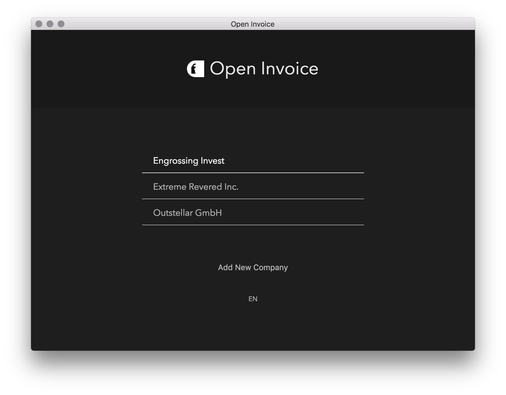

    
     
    
    

# Open Invoice

Open Source, [Electron-React-Boilerplate](https://github.com/electron-react-boilerplate/examples/tree/master/examples/typescript)-based application for invoicing.

    

