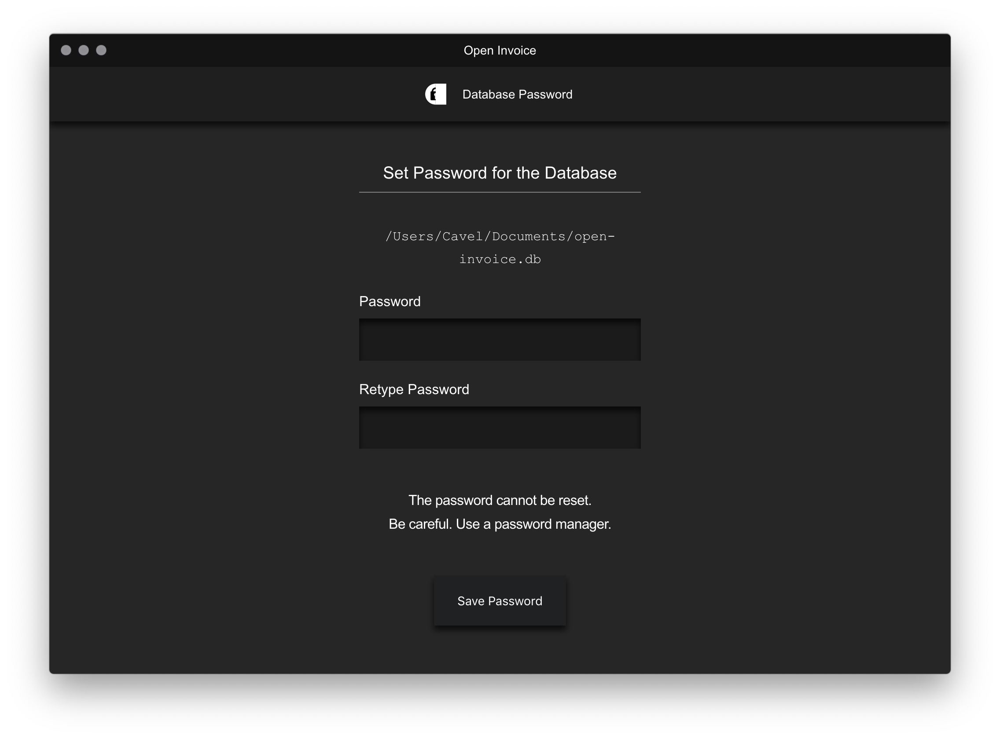
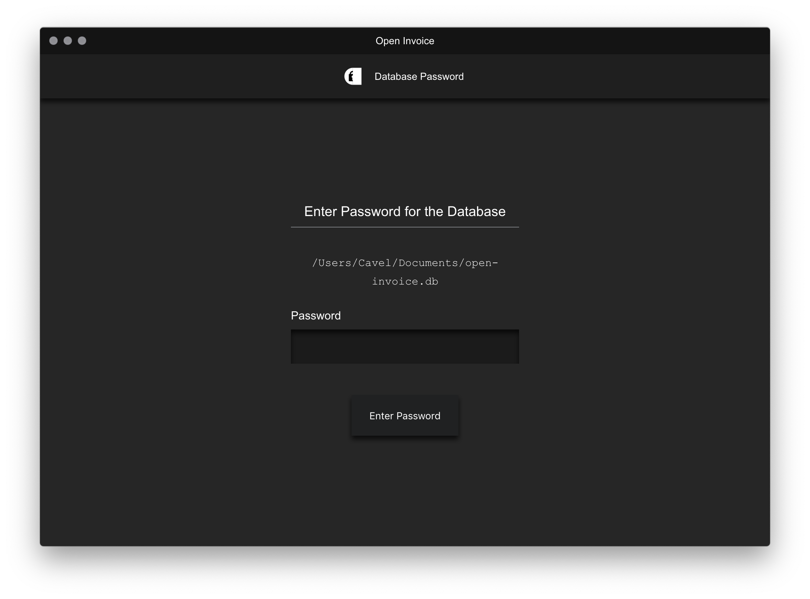

    
     
    
    

# Open Invoice

Open Source, [Electron-React-Typescript-boilerplate](https://github.com/electron-react-boilerplate/examples/tree/master/examples/typescript)-based application for invoicing.

## Install

Download the application for the specific operating system.

## App

    

Home

    

Choose Database

    

Create Database

    

Select Database

